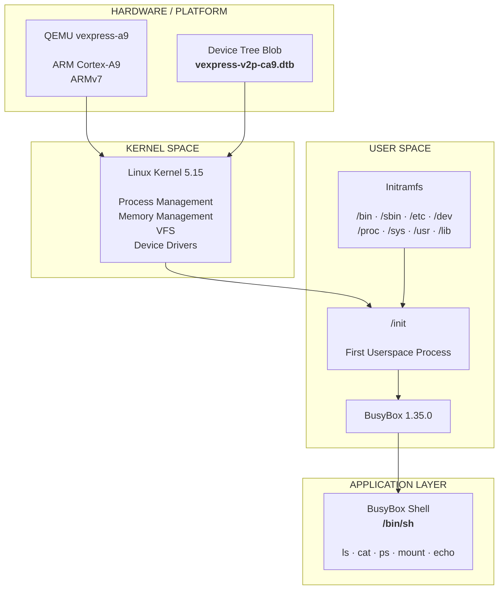
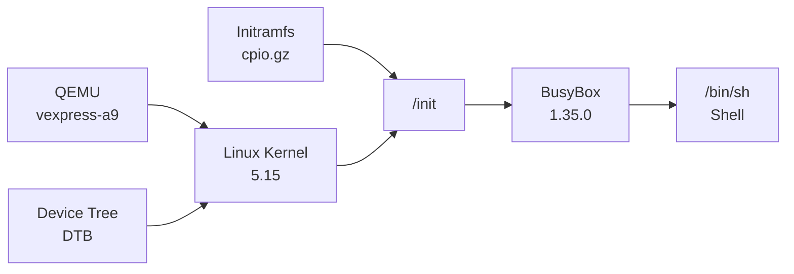
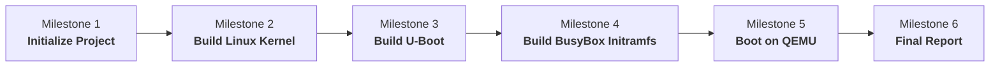

# Embedded Linux Lab 1

<p align="center">
  
  
  
  
  
</p>

<p align="center">
  <b>A minimal ARMv7 Embedded Linux system built from source and booted with QEMU.</b>
</p>

<p align="center">
  Linux Kernel 5.15 · U-Boot 2022.04 · BusyBox 1.35.0 · Initramfs · ARM Cortex-A9
</p>

---

## Overview

This repository contains the complete implementation of **Embedded Linux Lab 1**, focusing on the fundamental architecture and boot process of an embedded Linux system.

The system is built for an **ARMv7 / Cortex-A9** platform and runs on the **QEMU `vexpress-a9`** machine.

The project covers the complete path from kernel and bootloader configuration to a working minimal Linux userspace:

```text
Linux Kernel
      +
   Device Tree
      +
    BusyBox
      +
    Initramfs
      ↓
QEMU ARM Platform
      ↓
Bootable Embedded Linux System
```

The final system successfully boots Linux Kernel 5.15 and provides an interactive BusyBox shell.

---

## Architecture

The system follows a layered Embedded Linux architecture:



### Component Layers

| Layer                | Component          | Role                                              |
| :------------------- | :----------------- | :------------------------------------------------ |
| Platform             | QEMU `vexpress-a9` | Emulates the ARM Versatile Express platform       |
| CPU                  | ARM Cortex-A9      | Target ARMv7 processor                            |
| Hardware Description | Device Tree        | Describes the virtual hardware to Linux           |
| Kernel Space         | Linux 5.15         | Process, memory, filesystem and device management |
| User Space           | BusyBox 1.35.0     | Minimal Unix utilities and shell                  |
| Root Filesystem      | Initramfs          | Provides the initial embedded Linux filesystem    |
| Application          | `/bin/sh`          | Interactive userspace shell                       |

---

## Boot Flow

The boot sequence of the final system is:



At runtime:

1. QEMU initializes the virtual ARM Cortex-A9 platform.
2. The Linux kernel is loaded.
3. The Device Tree provides the hardware description.
4. The kernel initializes CPU, memory and devices.
5. The initramfs is mounted as the initial root filesystem.
6. `/init` becomes the first userspace process.
7. BusyBox initializes the userspace environment.
8. `/bin/sh` provides the interactive shell.

---

## Project Goals

The laboratory focuses on the following objectives:

* Understand the Embedded Linux boot architecture.
* Configure and cross-compile Linux Kernel for ARMv7.
* Configure and build U-Boot.
* Build a minimal BusyBox userspace.
* Construct an initramfs root filesystem.
* Generate and use a Device Tree Blob.
* Boot the complete system using QEMU.
* Verify the kernel, root filesystem and userspace environment.
* Manage the project using Git milestone-based development.

---

## Technology Stack

| Component       | Version / Configuration |
| :-------------- | :---------------------- |
| Architecture    | ARMv7                   |
| CPU             | ARM Cortex-A9           |
| Emulator        | QEMU `vexpress-a9`      |
| Kernel          | Linux 5.15              |
| Bootloader      | U-Boot 2022.04          |
| Userspace       | BusyBox 1.35.0          |
| Root filesystem | Initramfs               |
| Device Tree     | `vexpress-v2p-ca9.dtb`  |
| Cross compiler  | `arm-linux-gnueabihf-`  |
| Console         | `ttyAMA0`               |
| Memory          | 512 MB                  |
| SMP             | 2 CPUs                  |
| Host OS         | Ubuntu Linux            |

---

## Repository Structure

```text
embedded-linux-lab1/
│
├── bao_cao/
│   └── MSSV_Lab01_BaoCao.pdf
│
├── configs/
│   ├── kernel.config
│   └── busybox.config
│
├── output/
│   ├── initramfs.cpio.gz
│   ├── u-boot
│   ├── vexpress-v2p-ca9.dtb
│   └── zImage
│
├── rootfs/
│   └── initramfs/
│       ├── bin/
│       ├── dev/
│       ├── etc/
│       ├── init
│       ├── lib/
│       ├── proc/
│       ├── root/
│       ├── sbin/
│       ├── sys/
│       ├── tmp/
│       └── usr/
│
├── .gitignore
└── README.md
```

The full source trees of Linux Kernel, U-Boot and BusyBox are excluded from Git tracking to keep the repository lightweight and focused on the laboratory deliverables.

---

## Build Environment

### Required Packages

```bash
sudo apt update

sudo apt install -y \
    build-essential \
    git \
    wget \
    curl \
    bison \
    flex \
    libncurses-dev \
    libssl-dev \
    libelf-dev \
    gcc-arm-linux-gnueabihf \
    binutils-arm-linux-gnueabihf \
    qemu-system-arm \
    qemu-utils \
    cpio
```

### Verify Toolchain

```bash
arm-linux-gnueabihf-gcc --version
```

### Verify QEMU

```bash
qemu-system-arm --version
```

---

## Linux Kernel

The project uses **Linux Kernel 5.15** configured for the ARMv7 Versatile Express platform.

Source directory:

```text
kernel/linux-5.15/
```

Configuration:

```text
configs/kernel.config
```

### Configure

```bash
cd ~/embedded_lab1/kernel/linux-5.15

export ARCH=arm
export CROSS_COMPILE=arm-linux-gnueabihf-

make versatile_defconfig
```

### Build

```bash
make -j$(nproc) zImage dtbs modules
```

Generated artifacts:

```text
arch/arm/boot/zImage
arch/arm/boot/dts/vexpress-v2p-ca9.dtb
```

Final repository artifacts:

```text
output/zImage
output/vexpress-v2p-ca9.dtb
```

---

## U-Boot

The project uses **U-Boot 2022.04** for the ARM Versatile Express platform.

Source directory:

```text
uboot/u-boot-2022.04/
```

### Configure

```bash
cd ~/embedded_lab1/uboot/u-boot-2022.04

export ARCH=arm
export CROSS_COMPILE=arm-linux-gnueabihf-

make vexpress_ca9x4_defconfig
```

### Build

```bash
make -j$(nproc)
```

Output:

```text
output/u-boot
```

---

## BusyBox

The project uses **BusyBox 1.35.0** as the minimal userspace environment.

Configuration:

```text
configs/busybox.config
```

BusyBox provides essential commands such as:

```text
sh
ls
cat
mount
ps
echo
mkdir
cp
mv
dmesg
```

The installed BusyBox filesystem is located at:

```text
rootfs/initramfs/
```

---

## Initramfs

The root filesystem is based on an initramfs image.

```text
rootfs/initramfs/
├── bin/
├── dev/
├── etc/
├── init
├── lib/
├── proc/
├── root/
├── sbin/
├── sys/
├── tmp/
└── usr/
```

The most important component is:

```text
rootfs/initramfs/init
```

The Linux kernel executes `/init` as the first userspace process.

### Create Initramfs

```bash
cd ~/embedded_lab1/rootfs/initramfs

find . -print0 | \
    cpio --null -ov --format=newc | \
    gzip -9 > ../../output/initramfs.cpio.gz
```

Final image:

```text
output/initramfs.cpio.gz
```

---

## QEMU

The complete system is booted using QEMU's ARM Versatile Express emulation.

### Boot Command

```bash
cd ~/embedded_lab1

qemu-system-arm \
    -M vexpress-a9 \
    -cpu cortex-a9 \
    -m 512M \
    -smp 2 \
    -nographic \
    -kernel output/zImage \
    -dtb output/vexpress-v2p-ca9.dtb \
    -initrd output/initramfs.cpio.gz \
    -append "console=ttyAMA0,115200 rdinit=/init mem=512M"
```

### Boot Parameters

| Parameter         | Purpose                                        |
| :---------------- | :--------------------------------------------- |
| `-M vexpress-a9`  | Select QEMU Versatile Express A9 machine       |
| `-cpu cortex-a9`  | Use ARM Cortex-A9 CPU                          |
| `-m 512M`         | Allocate 512 MB RAM                            |
| `-smp 2`          | Enable two virtual CPUs                        |
| `-nographic`      | Use terminal as the console                    |
| `-kernel`         | Load Linux kernel                              |
| `-dtb`            | Load Device Tree Blob                          |
| `-initrd`         | Load initramfs                                 |
| `console=ttyAMA0` | Configure serial console                       |
| `rdinit=/init`    | Execute `/init` as the first userspace process |

---

## Verification

After a successful boot, the system provides a BusyBox shell:

```text
/ #
```

### Kernel

```bash
uname -a
```

Example output:

```text
Linux embedded-lab 5.15.0 #4 SMP Mon Sep 14 10:24:45 +07 2026 armv7l GNU/Linux
```

This confirms the ARMv7 Linux kernel is running successfully.

### Root Filesystem

```bash
ls /
```

Expected:

```text
bin
dev
etc
init
lib
proc
root
sbin
sys
tmp
usr
```

### Mounted Filesystems

```bash
mount
```

Expected entries include:

```text
rootfs on / type rootfs
none on /proc type proc
none on /sys type sysfs
none on /tmp type tmpfs
```

### Processes

```bash
ps
```

The system should contain:

```text
PID   USER     TIME  COMMAND
1     root     0:00  init
```

followed by kernel threads and the BusyBox shell.

---

## Output Artifacts

| Artifact                        | Description                |
| :------------------------------ | :------------------------- |
| `output/zImage`                 | ARMv7 Linux kernel image   |
| `output/vexpress-v2p-ca9.dtb`   | Device Tree Blob           |
| `output/u-boot`                 | U-Boot executable          |
| `output/initramfs.cpio.gz`      | Compressed initramfs       |
| `configs/kernel.config`         | Linux Kernel configuration |
| `configs/busybox.config`        | BusyBox configuration      |
| `bao_cao/MSSV_Lab01_BaoCao.pdf` | Laboratory report          |

---

## Development Milestones

The project history is organized into incremental milestones:



| Milestone | Commit    | Description                     |
| :-------- | :-------- | :------------------------------ |
| 1         | `a02c945` | Initialize Embedded Linux Lab 1 |
| 2         | `f69139b` | Build Linux kernel for ARMv7    |
| 3         | `af555d0` | Configure and build U-Boot      |
| 4         | `580ce09` | Build BusyBox initramfs         |
| 5         | `d46ac08` | Boot Linux and BusyBox on QEMU  |
| 6         | `fc1cd13` | Add final Lab 1 report          |

---

## Final System

```text
┌──────────────────────────────────────────────┐
│              Embedded Linux System            │
├──────────────────────────────────────────────┤
│                                              │
│  Architecture     ARMv7                     │
│  CPU              Cortex-A9                 │
│  Machine          QEMU vexpress-a9          │
│  Kernel           Linux 5.15                │
│  Bootloader       U-Boot 2022.04            │
│  Userspace        BusyBox 1.35.0            │
│  Root filesystem  Initramfs                 │
│  Memory           512 MB                    │
│  CPUs             2                         │
│  Console          ttyAMA0                   │
│                                              │
└──────────────────────────────────────────────┘
```

### Verified

```text
✓ ARMv7 kernel boot
✓ Device Tree loading
✓ Initramfs mounting
✓ /init execution
✓ BusyBox initialization
✓ Interactive shell
✓ /proc filesystem
✓ /sys filesystem
✓ Process listing
✓ Basic userspace utilities
```

---

## Learning Outcomes

This laboratory provided practical experience with:

* ARM cross-compilation
* Linux Kernel configuration and compilation
* U-Boot configuration and compilation
* Device Tree
* BusyBox userspace
* Initramfs construction
* Embedded Linux boot flow
* QEMU ARM emulation
* Linux filesystem initialization
* Process management
* Git milestone-based development

---

## Lab 2

**Embedded Linux Lab 2** continues from this Lab 1 environment and focuses on Linux kernel module and device-driver development.

Topics include:

* Character device driver
* Kernel modules
* `/dev/lab2`
* `/proc/lab2_info`
* Sysfs attributes
* QEMU driver testing
* NAND simulator
* JFFS2 filesystem

Lab 2 is maintained separately to preserve the Lab 1 baseline.

---

## Author

**Embedded Linux Lab 1**

**Student:** Hoang Trung Hai
**Student ID:** SS20****
**University:** FPT University
**Major:** IC Design

---

## License

This repository is an academic laboratory project created for educational purposes.

The project uses open-source components including Linux Kernel, U-Boot, BusyBox, and QEMU. The original licenses of these components remain applicable to their respective components.
